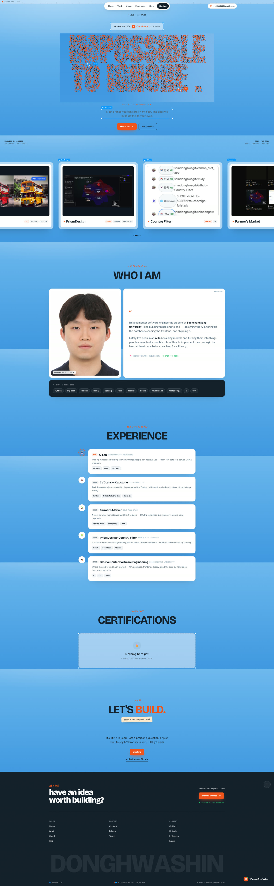

# Donghwa Shin — Portfolio



**Live:** https://shindonghwa-portfolio.vercel.app

A bright, sky-blue single-page portfolio — playful, interaction-rich, and built
from scratch: an intro loader, a cursor that trails a "You" tag, reactive
headline letters, a pinned horizontal project scroll, and per-project popups.

## Stack

- React 19 + TypeScript + Vite 8
- [Tailwind CSS v4](https://tailwindcss.com) (`@tailwindcss/vite`)
- [motion](https://motion.dev) — intro loader, scroll reveals, pinned scroll, popups
- Fonts: Hanken Grotesk, Space Mono, Bricolage Grotesque, Caveat

## Run

```bash
npm install
npm run dev      # http://localhost:5173
npm run build    # tsc -b && vite build → dist/
npm run preview  # serve the production build
```

## Structure

```
src/
  main.tsx               renders the landing page
  types.ts               Project type
  data/projects.ts       project entries (used by the Work popups)
  ohh/
    OhhLanding.tsx        page composition
    ohh.css               Tailwind + design tokens + keyframes
    components/           Topbar, Ruler, Clouds, Cursors, IntroLoader,
                          ChatWidget, ReactiveText, bits, useClock
    sections/             Hero, Work, About, Experience,
                          Certifications, Cta, Footer
```

## Contact

- ek65110112@gmail.com
- [github.com/shindonghwagit](https://github.com/shindonghwagit)
