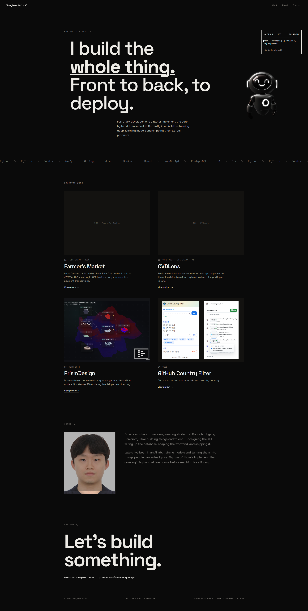

# Portfolio — Donghwa Shin

**Live:** https://shindonghwa-portfolio.vercel.app



Personal portfolio site. Dark, minimal, big type, hand-written CSS.

## Stack

- React 19 + TypeScript + Vite 8
- [motion](https://motion.dev) — scroll-in reveals, hero stagger
- [lenis](https://lenis.darkroom.engineering/) — smooth scroll
- Plain CSS (no Tailwind, no UI framework)
- Fonts: Space Grotesk + Space Mono

## Run

```bash
npm install
npm run dev      # http://localhost:5173
npm run build    # tsc -b && vite build → dist/
npm run preview  # serve the production build
```

## Structure

```
src/
  App.tsx              Lenis + custom cursor + section composition
  main.tsx
  index.css            design tokens, globals, all component styles
  types.ts             Project type
  data/projects.ts     work entries + focus areas
  lib/useSeoulTime.ts  KST clock hook
  components/
    Navbar.tsx
    Hero.tsx
    RobotScene.tsx     Spline 3D character embed
    StatusCard.tsx     live KST clock
    FocusMarquee.tsx   infinite scrolling focus bar
    Work.tsx
    ProjectCard.tsx
    About.tsx
    Contact.tsx
```

## Contact

**Live:** https://shindonghwa-portfolio.vercel.app

- ek65110112@gmail.com
- [github.com/shindonghwagit](https://github.com/shindonghwagit)
